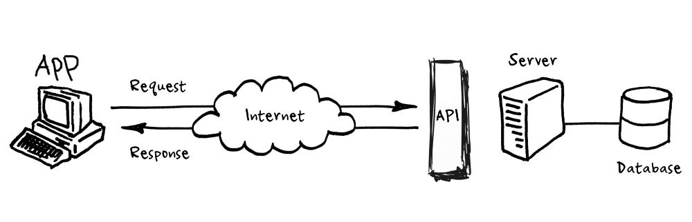

## Introduction API (Application Programming Interface)
### General Overview
In basic terms, **APIs just allow applications to communicate with one another**. When people speak of **“an API”**, they sometimes generalize and actually mean “a publicly available web-based API that returns data, likely in JSON or XML”.  The API is not the database or even the server, it is the code that governs the **_access point(s)_** for the server.

Think of an API like a menu in a restaurant. The menu provides a list of dishes you can order, along with a description of each dish. When you specify what menu items you want, the restaurant’s kitchen does the work and provides you with some finished dishes. You don’t know exactly how the restaurant prepares that food, and you don’t really need to. In this Documentation we will focus on these specific kinds of APIs, how client request data and how server response.