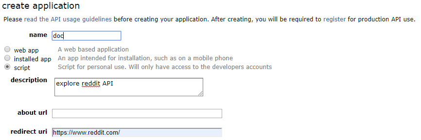
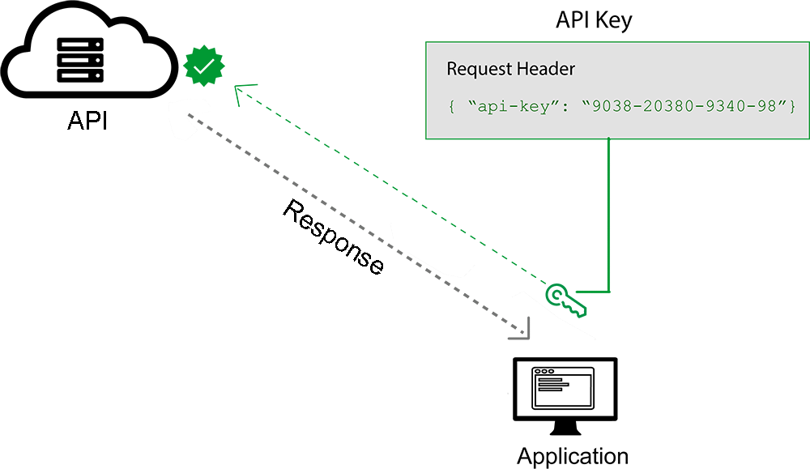
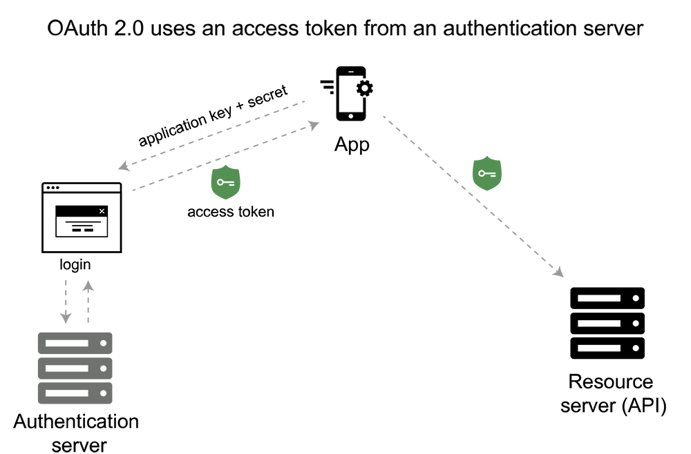

# Introduction API (Application Programming Interface)
## Table of Content
1. **What is API?**
	- [General Overview](#general-overview)
	- [Why would we need an API?](#why-would-we-need-an-api)
2. **A Deeper Dive into API**
	- [API - What is JSON and why do we use it in API?](#api-what-is-json-and-why-do-we-use-it-in-api)
	- [API - HTTP Method](#api-http-method)
	- [API - Request/Response Headers and Body](#api-requestresponse-headers-and-body)
		- [What is Request/Response Headers?](#what-is-requestresponse-headers)
		- [What is Request/Response Body?](#what-is-requestresponse-body)
3. **Principles of Designing APIs**
	- [Authorization](#authorization)
	- [Keep it simple](#keep-it-simple)
	- [Use of the right HTTP methods](#use-of-the-right-http-methods)
	- [Use pagination (limit)](#use-pagination-limit)
	- [Supported formats](#supported-formats)

## General Overview
Connectivity is an amazing thing, by now we're all used the instant connectivity that puts the world at our fingertips from desktop or devices. We can purchase, post, pin, and pick anything, anywhere, _but how does it happen? how does data get from here to there? how do different devices and applications connect with each other?_ The unsung hero of our connected world is **_Application Programming Interface_** or **_API_**

In basic terms, **APIs just allow applications to communicate with one another**. **_API_** is not the database or even the server, it is the code that governs the **_access point(s)_** for the server. To speak plainly an **_API_** is the messenger that takes request and tells the system what you want to do, and then returns the response back to you. . When people talk about **_"API"_**, they sometimes generalize and actually mean "a publicly available web-based API that returns data, likely in JSON or XML".


Think of an **API** like a menu in a restaurant. The menu provides a list of dishes you can order, along with a description of each dish. When you specify what menu items you want, the restaurant’s kitchen does the work and provides you with some finished dishes. You don’t know exactly how the kitchen prepares that food, and you don’t really need to. **_But what's missing is the critical link to communicate your order to the kitchen and deliver your food back to your table,_** that's where the waiter or **_API_** comes in. The waiter is the messenger that takes your order or (let's say this) **_API Request_** to tells the kitchen what to do, and then delivers (let's say this) **_API Response_** back to you, in this case **"food"**.


## Why would we need an API?
Imagine the following scenario: You wants to access another app’s data or functionality. For example, perhaps you want to access all posts on reddit. You could email Reddit and ask for a spreadsheet file of all posts. But then you’d have to find a way to import that spreadsheet into your application, even if you stored them in a **_database_**, the data would become **outdated very quickly**. It would be impossible to keep it up to date. It would be better and simpler for Reddit to provide you a way to query their application to get that data, so that you can view or use it in your own application. It would stay up to date automatically that way. 

Reddit has **_Public API (meaning one that does not require authentication/login)_** directly in your browser, lets take a look this **_[API REDDIT POSTS](https://www.reddit.com/r/all/.json)_** , and what we get is a **response** to our **_API request_**. Basically we've made an **_API request_** in our browser to **_Reddit's Public API_**.
>These data below are raw version of the information that you can see at **_~~API~~ [REDDIT POSTS](https://www.reddit.com/r/all/)_**.


Now what we get might appear to be gibberish to the human eye but it's actually **_JSON (Javascript Object Notation)_ formatted data**, it's structured data organized according to key value pairs. You can make an **_API Request_** with **Postman** [[Download]](https://www.getpostman.com/downloads/) to get more **"easy to read"** result, if already have it you can make an **_API Request_** like this image below

>Blue pen  : **_HTTP_** method set to **_GET_** (we'll talk about HTTP method later)

>Red pen   : **_Reddit's API_**

>Green pen : Response from **_API_**


## API - What is JSON and why do we use it in API?
>**Note**: **A Deeper Dive into API**, it's a little bit "Technical". But this is really ~~josss~~ good if you want to know what happen when we **Request to API** and get **Response back from API**.

Let's talk about **_JSON_**, as we mentioned before **it's structured data organized according to key value pairs**, let's take a look at this simple **_JSON_**
```
"restaurant": {
	"name": "Fish Witch",
	"address": "Antapani",
	"zipcode": "40291",
	"phone": "08xx-xxxx-xxxx",
	"website": "http://example.com",
	"email": "info@example.com"
}
```
Neat. This is fairly easy to read — our data is stored as key/value pairs. This means that we can see the key on the left, in this case **_name, address, zipcode, website, email_**, and the value on the right, in this case **value of "name" is _Fish Witch_** and so on. A different Restaurant would have a different value, but its key would be the same — it would always have a **_name, address, zipcode, website, email_**.
For example you make an **_API Request_** to get data from restaurant "Puri Purr", **_API Response_** would be like this:
```
"restaurant": {
	"name": "Puri Purr",
	"address": "Arcamanik",
	"zipcode": "40293",
	"phone": "022-xxxx-xxxx",
	"website": "http://puripurr.com",
	"email": "contact@puripurr.com"
}
``` 
As you can see the key stays the same for each restaurant, but the value would be different. Each **_API_** must define its own format for the data that it serves, **developers** typically read documentation provided by the **_API_ “maintainer”** (Reddit in this case) in order to learn the data format and use it properly. The question is **_why JSON?_** because it’s readable, it’s lightweight, but the most important, **it's comparatively easy** to get applications written in **other programming languages** to read it and generate it as well. This means that an **_API_** that returns **_JSON_** can be accessed by an application written in programming languages C#, Java, Ruby, Python, JS, PHP and many more, this makes an API scalable and platform independent.


## API - HTTP Method
Until now we've only been consuming data from **_API_**, but you can also write/send data to **_API_**, for example you can send **customer information, file upload, etc**, but before we go down that road we need to talk a little bit about the concept of **_HTTP request method_**. There are several **_HTTP method_** but the big two that you really need to know are **_GET_** and **_POST_**. A **_GET request_** is what you used to consumed data, that's what we've done so far by passing **_URL_** in order to get data from the **_API_**. But a **_POST Request_** a little bit different, this method requests that a web server accepts the data enclosed in the body of the request message, most likely for storing it. It is usually used when you need to send file or data/information.
>**Note**: We'll talk about **_body request_** later.

Normal web browser doesn't allow you to put data in the body of a request, but you can make a **_POST Request_** with **Postman** [[Download]](https://www.getpostman.com/downloads/), the nice thing about working with **Postman** is you can make more complex **_API Request_**, for example you can choose any one of the available **_HTTP Methods_** on the list, second you can put data in the body of a request, and the last one you can add headers to your **_API Request_**.
>**Note**: We'll talk about **_request and response headers_** later.


## API - Request/Response Headers and Body
#### **What is Request/Response Headers?**
What is **Headers** in **_API_**? To say briefly headers are some kind of information about your **_Request_** and **_Response API_**. They define the operating parameters of an **_HTTP transaction_**. For security reasons, some **_Headers_** can only be controlled by the user agent **(We won't talk about this)**. 

Headers in a Request API usually contains some kind of information to the format of the request and allowed format of the response **_(XML, JSON, etc)_**, or to give some kind of **_Authentication_**. A little bit different, **_Response Headers_** provide information about the status of the request and format of the response.
>**Note**: We'll talk about **_Authentication_** later.

Maybe it's a little bit confusing, what is it looks like? Lets open **Postman** [[Download]](https://www.getpostman.com/downloads/), and choose **Postman Console** on the bottom of the application **(Ctrl + Alt + C)**.

After that, let's fill the input field with **https://www.reddit.com/r/all/.json** and then click **Send**. Wait for a couple seconds, and let's take a look on **Postman Console**. Some kind of information would appear in your **Postman Console**, just like image below.

Let's take a look on **_Request Headers_**, as you can see there are some kind of information. These informations are **_Request Headers_**, **Headers** are transmitted after the request line (in case of a request HTTP message) or the response line (in case of a response HTTP message), which is the first line of a message.
```
Request Headers:
	User-Agent:"PostmanRuntime/7.15.2"
	Accept:"*/*"
	Cache-Control:"no-cache"
	Postman-Token:"cec80382-8cd9-4747-ace2-da42fe79db3a"
	Host:"www.reddit.com"
	Cookie:"loid=000000000049bvibpr.2.1564396818366.Z0FBQUFBQmRQczBTQ2VJVlhXU0dYaFBMd3ZwUlFLd2lMaTUxSlNEekJk
		dGp4MGlSejk1ZkJsUWN2ZVZKRE9tbDVhMDFZX2F4dDFHTXZ5cTdGV1VMVzNZeUtMVjM2WFYtVE9vODE1U1I0bVZtNjR6UENKckZj
		ZGVSMDRMR0hNOXRDR1MxV1VGRzZvRm4; edgebucket=GqcSo8cyBMd8dM847X; rseor3=true; rabt=; session_tracker=
		jcQ7jfC1E76WG5gXP9.0.1564546143430.Z0FBQUFBQmRRUlJmNEZrcXU4Z3c0UU9iSXlWNkc0QkV5QjMxQlRETjJmYUZDME5LS
		W9xREN3NEdVVzBGTUdwMzY5LV9ham4yOWFDQkRITUE1NnJxUFRYZE8zVVdDMTNQRVhnaS1SWEttM0pvU0N4NFlYZnJoZE1DbXFDd
		FNlT0pFbEVGREVDczc5ZXo"
	Accept-Encoding:"gzip, deflate"
	Connection:"keep-alive"
```
```
Response Headers:
	status: 200
	Content-Type:"application/json; charset=UTF-8"
	x-ua-compatible:"IE=edge"
	x-frame-options:"SAMEORIGIN"
	x-content-type-options:"nosniff"
	x-xss-protection:"1; mode=block"
	........
```
There are so many informations, but take a look at **status: 200** in **_Response Headers_**, what is that mean? That is **Response Status Code**. **Status code** indicates whether the request was successful, and if not, the type of error that occurred.


There are several **Status Code**, but these are list of Status Code that you really need to know

|Code            |Description                                                  |
|----------------|-------------------------------------------------------------|
|200             |OK : the request was successful.                             |
|400             |Bad Request: the request was not properly formed and therefore was not successful. |
|404             |Not Found: the URL/URI path is incorrect, or communication with the server was unsuccessful. |
|405             |Method Not Allowed: the syntax of the request does not match the request type. The Allow header provides more information about the supported types. |
|406             |Not Acceptable: the Accept header response type is not supported. |
|500             |Internal Server Error: this status indicates that an error occurred on the server and it was unable to respond. |

#### **What is Request/Response Body?**
Before we try about how **Request/Response Body** works, lets talk about the concept of **_Authentication_**, obviously you need to give some kind of **_Authentication_**. In this case let's say if you're gonna post something on **Reddit**, and what they're using for **Authentication** is what's known as **_OAuth_** or **_OAuth2_**. Basically what you're doing is getting credentials (kind of like a username and passsword) although they called a **client ID** and **client Secret**, and then you're exchanging those for what's known as an **_access token_** and then pass that **_access token_** to Reddit, Reddit knows that the **request** to make the Post is coming from you, so it **creates** a new Post from your account.

So here's what we gonna do in this section, we gonna try to create new Post from our account with API. Maybe in real project you can implement this on your App. The first step is we need to register our App on Reddit to get client ID and client Secret (Register here: https://www.reddit.com/prefs/apps). Click **"create another app..."**,  and then fill the forms, see image below for detail information:


After that click **"create app"**


## Principles of Designing APIs
Now let's understand the principles we should follow while designing the **_RESTful APIs_**.
#### **_Authorization_**
This is most important, before users can make requests with your **_API_**, they’ll usually need to register for an **_API_** key or learn other ways to authenticate the requests. **_APIs_** vary in the way they authenticate users. Some APIs require you to include an API key in the request header, while other APIs require elaborate security due to the need to protect sensitive data, prove identity, and ensure the requests aren’t tampered with.
- **Authentication:** Refers to proving correct identity
- **Authorization:** Refers to allowing a certain action


An API might authenticate you but not authorize you to make a certain request. **Why do APIs even need authentication?** For read-only **_APIs_**, sometimes users don’t need keys. But most commercial APIs do require authorization in the form of **_API_** keys or other methods. If you didn’t have any **security** with your **_API_**, users could make unlimited amounts of **_API_** calls without any kind of registration. Allowing unrestricted requests would make a revenue model for your **_API_** difficult. 

Additionally, without authentication, there wouldn’t be an easy way to associate requests with specific user data. And there wouldn’t be a way to protect against requests from malicious users that might delete another user’s data (such as by making DELETE requests on another’s account). There are several methods for authorization, but most often used are **_API keys_**, and **_OAuth or OAuth2_**.

**_API Keys_** 

**_API Keys_** require you to sign up for an API key in order to use when you send **_Request to API_**. The API key mainly functions as a way to identify the person making the API call (authenticating you to use the API). The API key might also be associated with a specific app that you register.


**_OAuth 2.0_**

On the other hand, one popular method for authenticating and authorizing users is **_OAuth 2.0_**. This approach relies on an authentication server to communicate with the API server to grant access. You often see **_OAuth 2.0_** when you’re using a site and are prompted to log in using a service like **Twitter, Google, or Facebook**. There are a few varieties of OAuth — namely, **_one-legged OAuth_** and **_three-legged OAuth_**. **_One-legged OAuth_** is used when you don’t have sensitive data to secure. This might be the case if you’re just retrieving general, read-only information. **_Three-legged OAuth_** is used when you need to protect sensitive data. Three groups are interacting in this scenario:
- The user or app
- The authentication server
- The resource server (API server)


First, the user sends over an **application key and secret** to a login page at the **authentication server**. If **authenticated**, the **authentication server** responds to the user with an **access token**. The user then makes a **request to the resource server (API server)**. The **access token** gets added to the **header of the API request**. The **API server checks the access token** in the user’s request and decides whether to authenticate the user.

**Access tokens** not only provide authentication for the requester but also define the **permissions of how the user can use the AP**I. Additionally, **access tokens usually expire after a period of time and require the user to log in again**.

#### **Keep it simple**
We need to make sure that the URL of the API is simple. For example, if we want to design APIs for return data users, it should be designed like this:
```
/users
/users/123
```
This first one is to get all users data and the second one is to get specific user.

#### Use of the right HTTP methods
APIs have various methods to indicate the type of operation we are going to perform with this API. We need to make sure we use the right HTTP method for a given operation.
- **_GET_** — To get a data or list of data.
- **_POST_** — To create a data or list of data (in some cases to get a data or list of data).
- **_PUT/PATCH_** — To update the existing data or list of data.
- **_DELETE_** - To delete the existing data or the list of data.

#### Use pagination (limit)
Use of **pagination** is a must when you expose an API which might return huge data, and if proper load balancing is not done, **the consumer might end up bringing down the service**. We always need to keep in mind that the API design should be full proof and foolproof. Use of **limit** and **offset** is recommended here. For example, /users?limit=25&offset=50. It is also advised to keep a default limit and default offset.	

#### Supported formats
It is also important to choose how your API responds. Most of the modern day applications should return JSON responses, unless your app still needs to get an XML response.


#### Standard API Template in Agate
[[Game Backend Netcore Template]](http://gate.git/code-bank/game-backend-netcore-template)