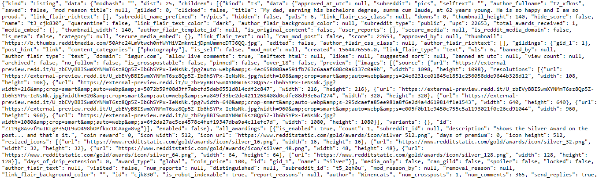

## Introduction API (Application Programming Interface)
### General Overview
Connectivity is an amazing thing, by now we're all used the instant connectivity that puts the world at our fingertips from desktop or devices. We can purchase, post, pin, and pick anything, anywhere, **but how does it happen? how does data get from here to there? how do different devices and applications connect with each other?** The unsung hero of our connected world is **_Application Programming Interface_** or **_API_**

In basic terms, **APIs just allow applications to communicate with one another**. **_API_** is not the database or even the server, it is the code that governs the **_access point(s)_** for the server. To speak plainly an **_API_** is the messenger that takes request and tells the system what you want to do, and then returns the response back to you. . When people talk about **_“API”_**, they sometimes generalize and actually mean “a publicly available web-based API that returns data, likely in JSON or XML”.

Think of an **API** like a menu in a restaurant. The menu provides a list of dishes you can order, along with a description of each dish. When you specify what menu items you want, the restaurant’s kitchen does the work and provides you with some finished dishes. You don’t know exactly how the kitchen prepares that food, and you don’t really need to. **_But what's missing is the critical link to communicate your order to the kitchen and deliver your food back to your table,_** that's where the waiter or **_API_** comes in. The waiter is the messenger that takes your order or **_request_** to tells the kitchen what to do, and then delivers **_the response_** back to you, in this case **"food"**.

### Why would we need an API?
Imagine the following scenario: You wants to access another **app’s data** or **functionality**. For example, perhaps you want to access all posts on reddit. You could email Reddit and ask for a spreadsheet file of all posts. But then you’d have to find a way to import that spreadsheet into your application, even if you stored them in a **_database_**, the data would become **outdated very quickly**. It would be impossible to keep it up to date. It would be better and simpler for Reddit to provide you a way to query their application to get that data, so that you can view or use it in your own application. It would stay up to date automatically that way. 

Reddit has **_Public API (meaning one that does not require authentication/login)_** directly in your browser, lets have a look this **_[API REDDIT POSTS](https://www.reddit.com/r/all/.json)_** , and what we get is a **response** to our **_API request_**. Basically we've made an **_API request_** in our browser to **_Reddit's Public API_**.
>These data are raw version of the information that you can see at ~~API~~ [REDDIT POSTS](https://www.reddit.com/r/all/).

Now what we get might appear to be gibberish to the human eye but it's actually **_JSON (Javascript Object Notation)_ formatted data**, it's structured data organized according to key value pairs. You can copy all of these data and paste to this link [[JSON FORMATTER]](https://jsonformatter.curiousconcept.com/) to get more **"easy to read"** result.
